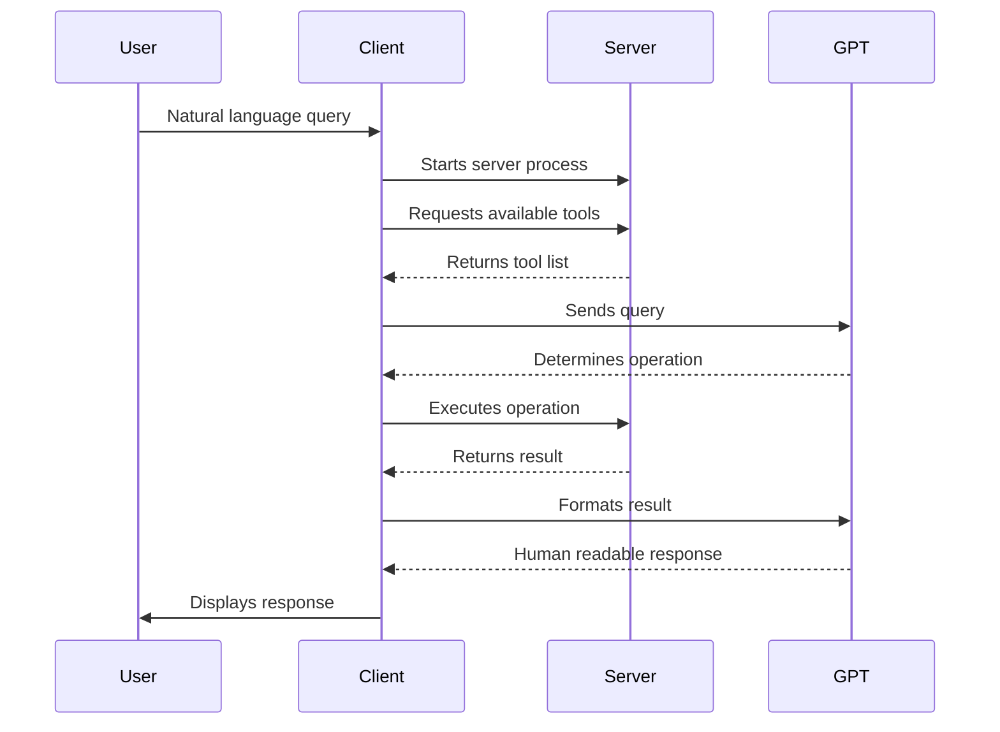

# Architecture Documentation

## Overview

This project provides a mathematical operations service leveraging a parent-child process architecture with STDIO-based
communication.
It integrates GPT-4 to interpret and process natural language mathematical queries, enabling seamless interaction and
accurate computations.

## Links
- [LangChain MCP Adapter](https://github.com/langchain-ai/langchain-mcp-adapters)
- [FastMCP](https://github.com/jlowin/fastmcp)

## Run
```bash
  python langchain-mcp-adapter/client.py
```

## Components

### 1. Math Server
- Runs as a child process
- Provides mathematical operations as tools
- Uses STDIO for communication
- Built with FastMCP framework
- Available tools:
  - add: Addition of two integers
  - multiply: Multiplication of two integers

### 2. Client
- Main process that:
  - Spawns the math server
  - Manages communication with GPT-4
  - Handles user requests
- Uses async/await for operations
- Integrates with LangChain for AI interactions

### 3. GPT-4 Integration
- Processes natural language queries
- Determines appropriate mathematical operations
- Returns human-readable responses

## Communication Flow



## Technical Details

### Transport
- Uses STDIO (Standard Input/Output) for inter-process communication
- Parent-child process architecture
- Asynchronous communication handling

### Server Configuration
- Runs as a Python process
- Uses FastMCP framework for tool management
- Tools are decorated with `@mcp.tool()`
- JSON-RPC protocol for message formatting

### Client Configuration
- Async implementation
- Session-based communication
- Integrated with LangChain and GPT-4
- Environment variables for API keys

## Benefits

1. **Performance**
   - Direct process communication
   - No network overhead
   - Efficient data transfer

2. **Security**
   - Isolated process execution
   - No network exposure
   - Controlled environment

3. **Simplicity**
   - No network configuration needed
   - Simple deployment
   - Direct process management

## Limitations

1. Must run on same machine (no distributed operation)
2. Limited to local process communication
3. Requires proper process management

## Usage

1. Configure environment variables
2. Start the client application
3. Send natural language queries
4. Receive calculated results

## Dependencies

- Python 3.x
- FastMCP
- LangChain
- OpenAI GPT-4
- AsyncIO
